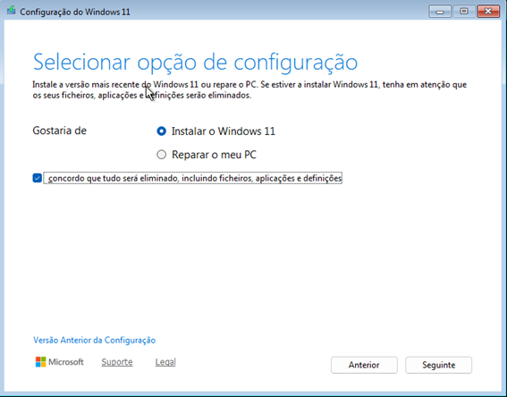
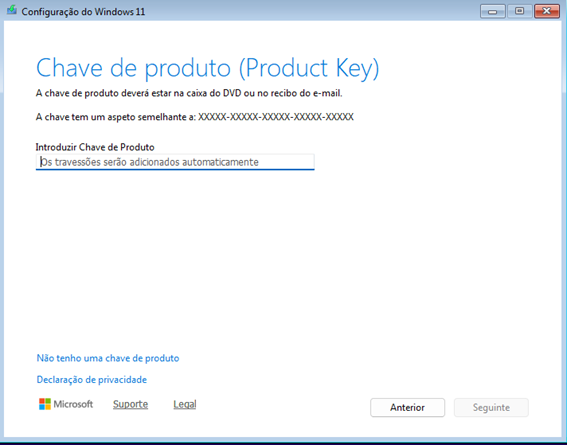
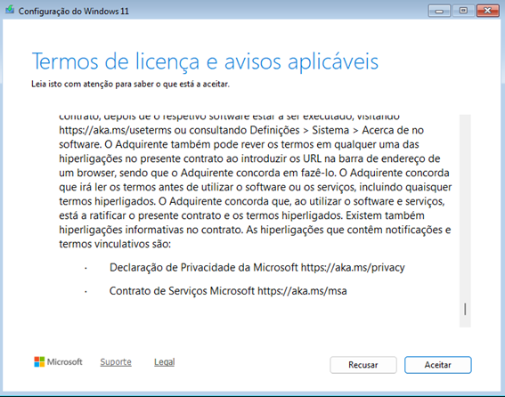
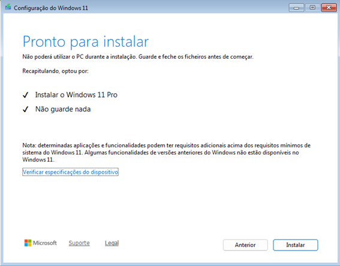
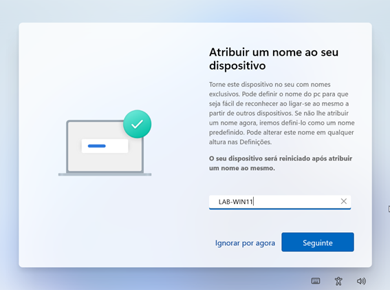
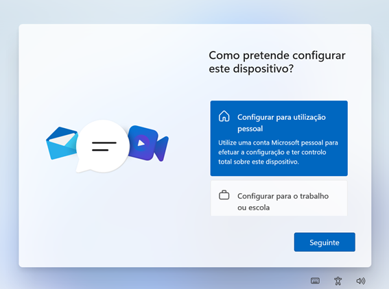
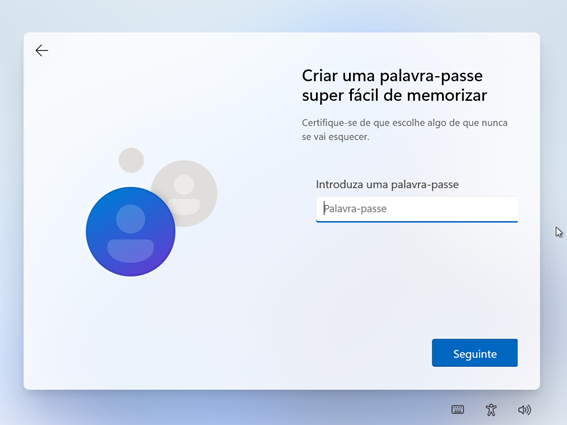
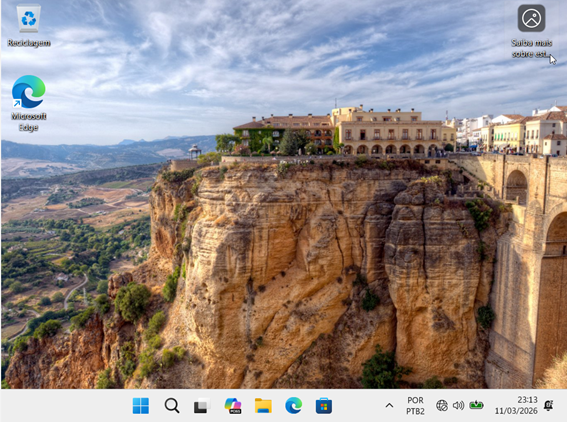

# Instalação do Windows 11 em Máquina Virtual (VirtualBox)

## Objetivo
Criar um ambiente virtual para praticar a instalação de sistema operacional e configuração inicial de um computador em laboratório de suporte de TI.

---

## Ferramentas utilizadas
* Oracle VirtualBox
* ISO do Windows 11
* Computador host (Windows)

---

## 1. Criação e Configuração da Máquina Virtual

Nesta etapa, foi preparado o hardware virtual para receber o sistema operacional.

*Ajuste de memória RAM e Processadores.*

*Definição do nome e tipo de sistema.*

*Montagem da imagem ISO no drive virtual.*

---

## 2. Passo a Passo da Instalação do Windows 11

Processo de configuração do disco e instalação dos arquivos do sistema.

1. **Opção de configuração:**

2. **Chave do produto:**

3. **Seleção da Edição:**

4. **Termos de Licença:**

5. **Configuração de Disco:**

6. **Pronto para Instalar:**

7. **Andamento da Instalação:**

---

## 3. Configuração Inicial (OOBE)

Configurações de usuário e personalização pós-instalação.

* **Região e Teclado:**

* **Nome do Dispositivo:**

* **Conta e Segurança:**

---

## Resultado Final
Sistema operacional Windows 11 instalado com sucesso e pronto para uso.

---

## Habilidades praticadas
* Virtualização
* Instalação de sistema operacional
* Configuração de máquina virtual
* Configuração inicial do Windows (OOBE)
* Criação de utilizador local
* Documentação técnica
