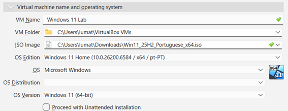
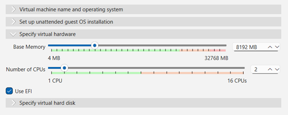
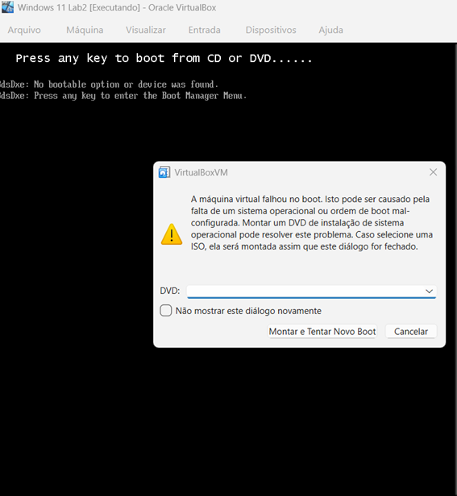
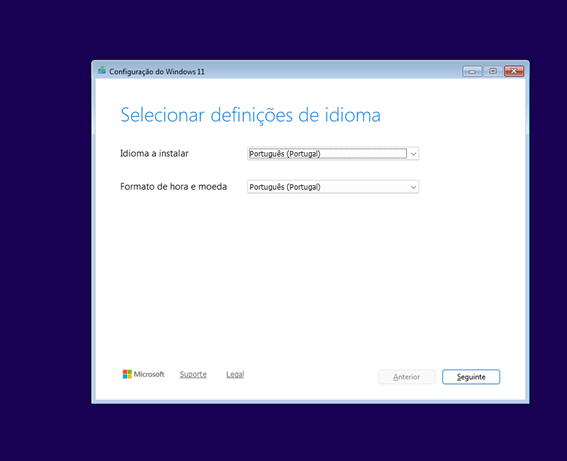
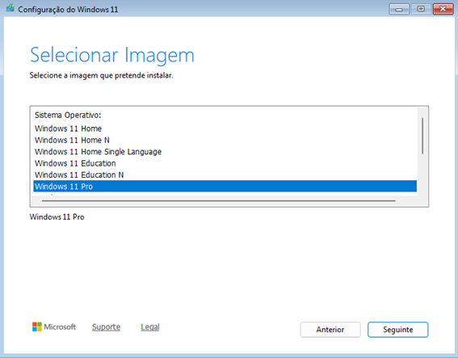
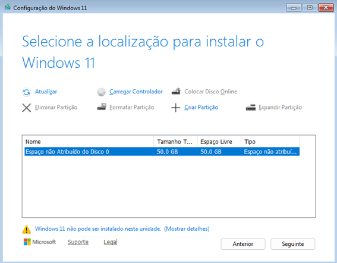
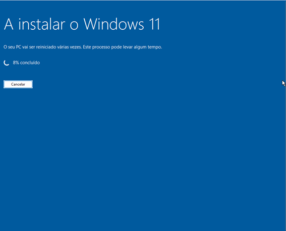
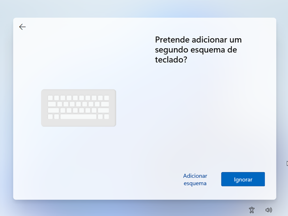
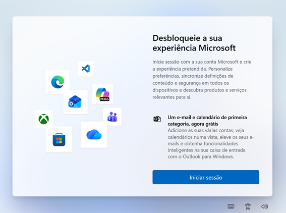
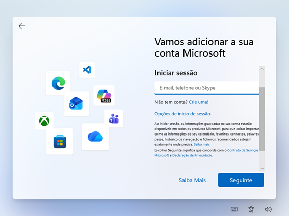

# Instalação do Windows 11 em Máquina Virtual (VirtualBox)

## Objetivo

Criar um ambiente virtual para praticar instalação de sistema operacional e configuração inicial de um computador em laboratório de suporte de TI.

---

# Ferramentas utilizadas

- Oracle VirtualBox
- Windows 11 ISO
- Computador host (Windows)

---

# Criação da máquina virtual

1. Abrir o Oracle VirtualBox
2. Clicar em **Novo**

3. Definir o nome da máquina virtual
4. Selecionar o sistema operacional **Windows 11 (64-bit)**

5. Configurar memória RAM e número de CPUs
6. Criar um disco virtual
7. Selecionar a imagem ISO do Windows 11

---

# Instalação do Windows

1. Iniciar a máquina virtual

2. Selecionar idioma, formato de hora e teclado

3. Clicar em **Instalar agora**

4. Inserir a chave do produto ou clicar em **Não tenho chave do produto**

5. Escolher a edição do Windows

6. Aceitar os termos de licença

7. Selecionar o disco virtual para instalação

8. Confirmar a instalação

9. Aguardar a instalação do sistema

---

# Configuração inicial do Windows

1. Selecionar a região

2. Selecionar o layout do teclado

3. Escolher se deseja adicionar um segundo teclado

4. Definir o nome do dispositivo

5. Escolher como configurar o dispositivo

6. Tela de login da conta Microsoft

7. Inserir email da conta Microsoft ou continuar com conta local

8. Criar utilizador do sistema

9. Criar senha do utilizador

---

# Resultado

Sistema operacional Windows 11 instalado com sucesso em uma máquina virtual.

---

# Habilidades praticadas

- Virtualização
- Instalação de sistema operacional
- Configuração de máquina virtual
- Configuração inicial do Windows
- Criação de utilizador local
- Documentação técnica
