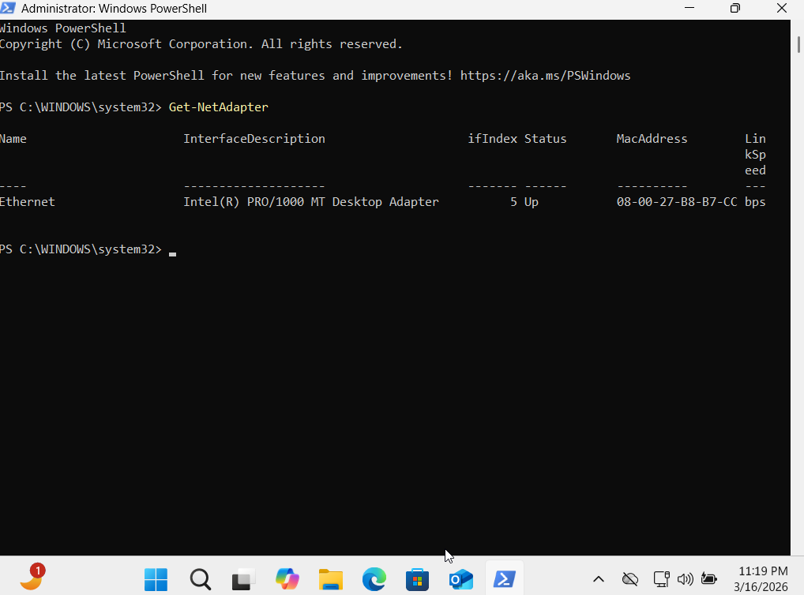
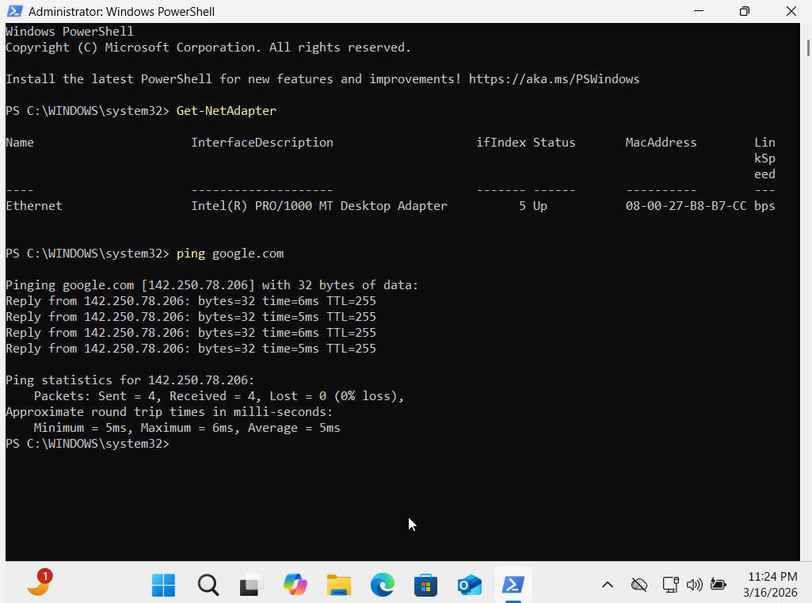
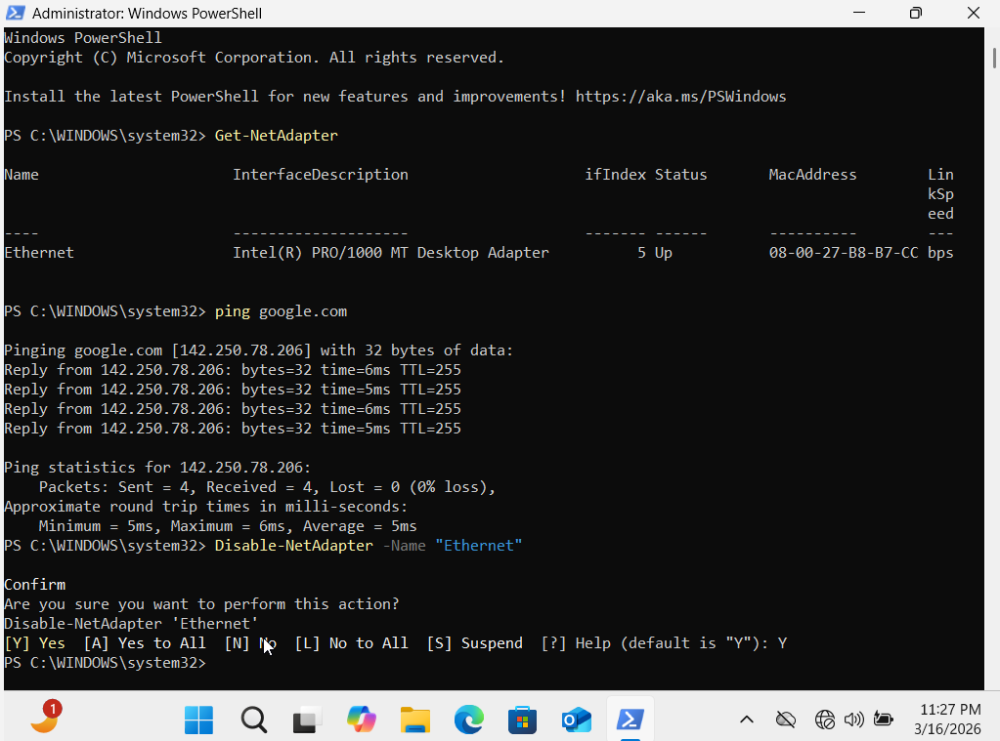
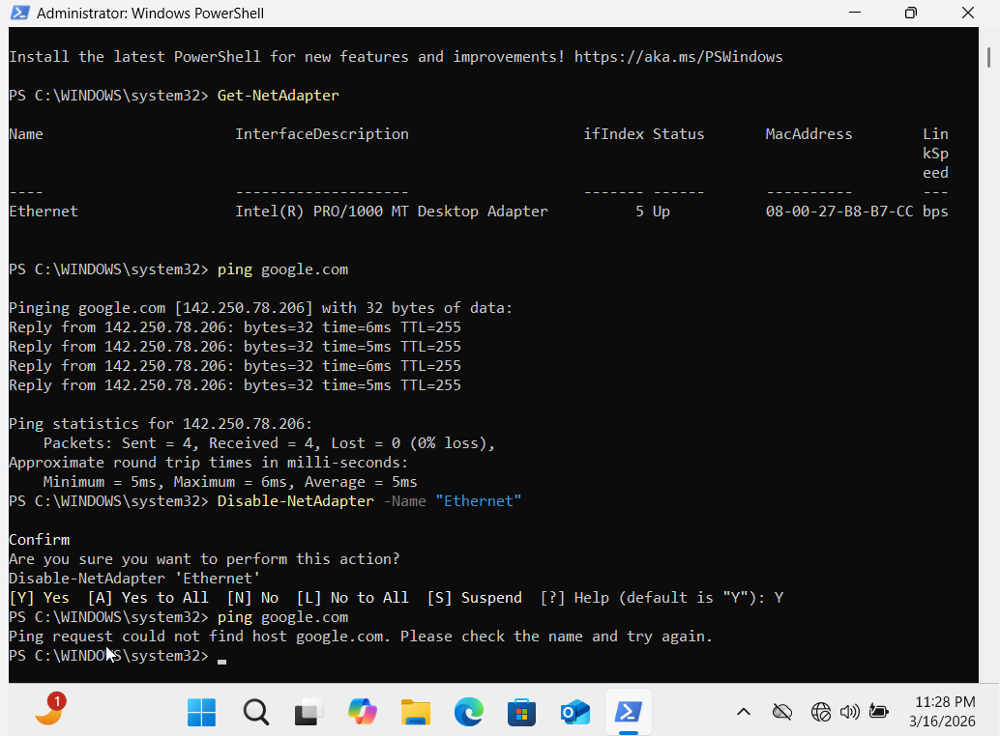
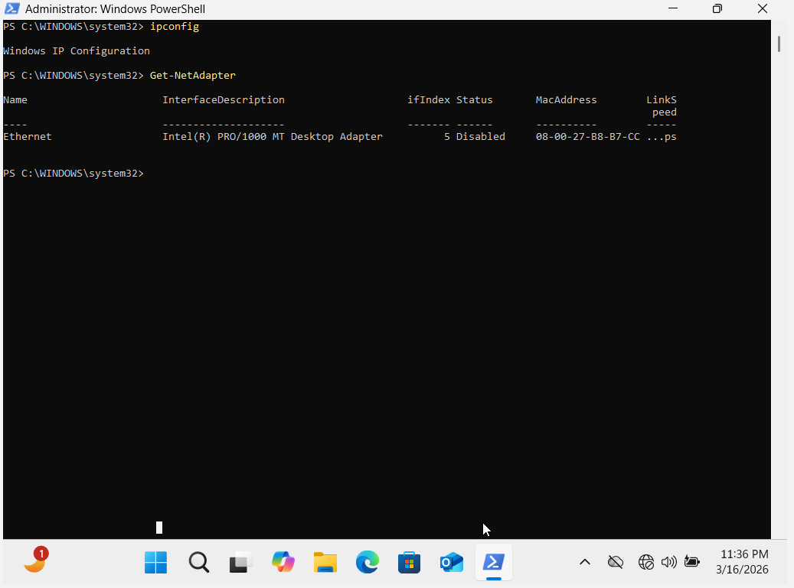
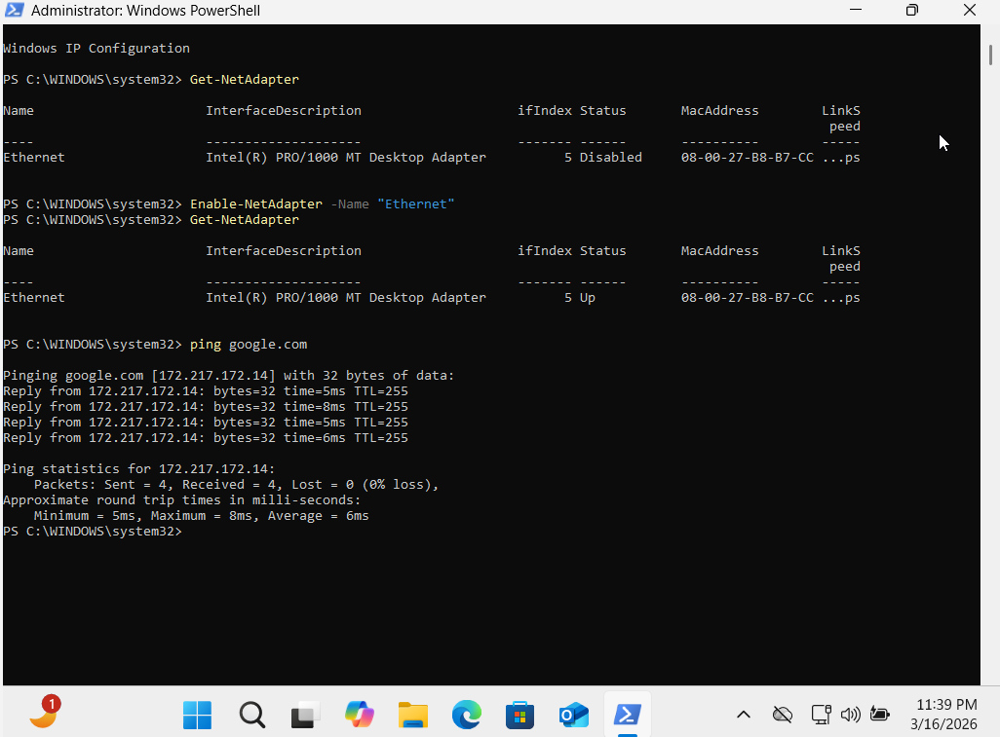

# Caso 01 — Computador sem acesso à internet no Windows

## Situação

Neste laboratório foi simulada uma falha de conectividade em uma máquina virtual Windows para reproduzir um problema comum no suporte técnico: um computador sem acesso à internet.

O objetivo foi identificar a causa da falha utilizando comandos do PowerShell e restaurar a conectividade da rede.

---

## Objetivo

Praticar um fluxo básico de troubleshooting de rede no Windows utilizando comandos do PowerShell para:

- identificar adaptadores de rede
- testar conectividade
- diagnosticar falhas
- restaurar a conexão

---

## Etapa 1 — Identificação do adaptador de rede

Primeiro foi utilizado o comando abaixo no PowerShell:

```powershell
Get-NetAdapter
```

Esse comando lista todos os adaptadores de rede do sistema, mostrando informações como:

- nome da interface
- status
- endereço MAC
- velocidade da conexão

No resultado foi possível identificar o adaptador **Ethernet**, que estava ativo.



---

## Etapa 2 — Teste inicial de conectividade

Para verificar se o computador possuía acesso à internet foi utilizado o comando:

```powershell
ping google.com
```

O comando `ping` envia pacotes para um servidor externo e verifica se há resposta.

O resultado mostrou resposta do servidor Google e **0% de perda de pacotes**, indicando que a conexão estava funcionando corretamente.



---

## Etapa 3 — Simulação da falha de rede

Para simular um problema real de suporte técnico, o adaptador de rede foi desativado manualmente com o comando:

```powershell
Disable-NetAdapter -Name "Ethernet"
```

Esse comando desativa a interface de rede no sistema operacional.



---

## Etapa 4 — Teste após a falha

Após desativar o adaptador, o teste de conectividade foi executado novamente:

```powershell
ping google.com
```

O comando retornou erro indicando que o host não poderia ser encontrado, confirmando que o computador não possuía mais conectividade de rede.



---

## Etapa 5 — Diagnóstico da interface de rede

Para investigar o problema foram utilizados os comandos:

```powershell
ipconfig
Get-NetAdapter
```

O comando `ipconfig` não exibiu interfaces de rede ativas.

Já o comando `Get-NetAdapter` mostrou que o adaptador **Ethernet estava com status Disabled**, confirmando que a interface de rede estava desativada.



---

## Etapa 6 — Restauração da conectividade

Para resolver o problema foi utilizado o comando:

```powershell
Enable-NetAdapter -Name "Ethernet"
```

Esse comando reativa o adaptador de rede.

Após a ativação, foi realizado novamente o teste de conectividade com:

```powershell
ping google.com
```

O teste voltou a responder normalmente, confirmando que a conexão com a internet foi restaurada.



---

## Conclusão

O problema de conectividade foi causado pela desativação do adaptador de rede Ethernet.

Durante o troubleshooting foram utilizados comandos do PowerShell para:

- identificar o adaptador de rede
- testar conectividade com a internet
- diagnosticar o estado da interface
- restaurar a conexão de rede

Esse laboratório simula um cenário real de suporte técnico, mostrando o processo completo de diagnóstico e resolução de um problema de rede no Windows.
