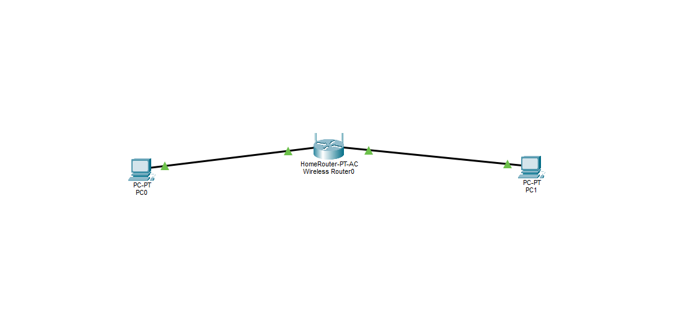
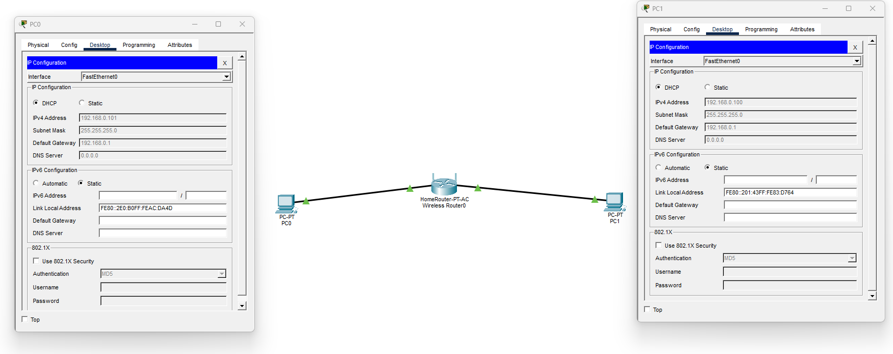
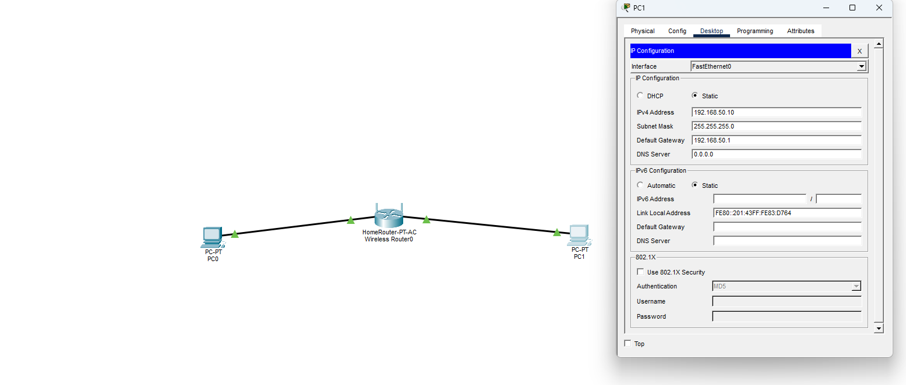
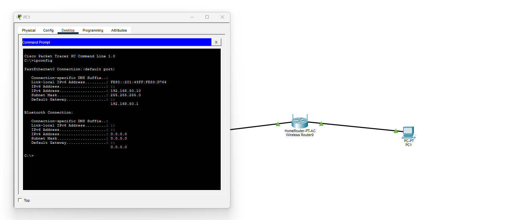
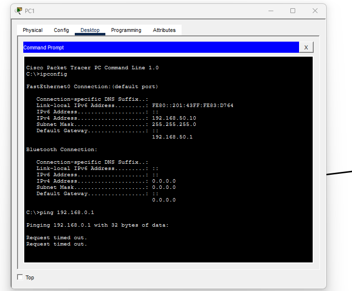
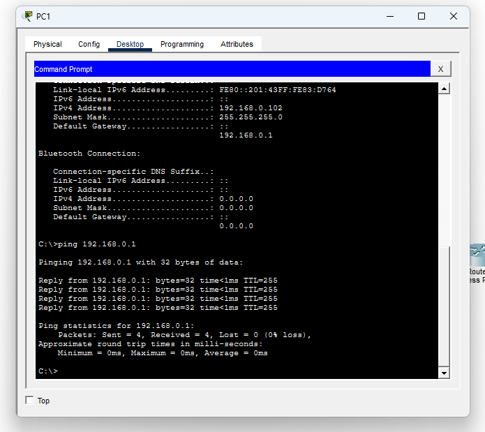

# 💻 Computador não recebe endereço IP (DHCP)

## 🧠 Cenário

Um computador não conseguia acessar a rede, mesmo estando fisicamente conectado ao roteador.

---

## 🎯 Objetivo

Diagnosticar e resolver um problema de conectividade causado por configuração incorreta de endereço IP.

---

## ✅ Estado inicial da rede

Antes da simulação do problema, os computadores estavam configurados para receber IP automaticamente via DHCP.

---

## ⚠️ Problema

Para simular a falha, um dos computadores foi configurado manualmente com um endereço IP em uma rede diferente da rede do roteador.

Exemplo da configuração incorreta:

- IP configurado: `192.168.50.10`  
- Máscara: `255.255.255.0`  
- Gateway: `192.168.50.1`

Rede correta do ambiente:

- `192.168.0.x`

Essa diferença impedia a comunicação com o gateway e com os demais dispositivos da rede.

---

## 🔍 Diagnóstico

### 1. Verificação das configurações de rede

O primeiro passo foi verificar o endereço IP do computador com problema.

---

### 2. Teste de conectividade com o gateway

Foi realizado um teste de comunicação com o gateway da rede.

Com isso, foi possível confirmar que o computador não estava na mesma rede do roteador.

---

## 🛠️ Solução

A correção foi feita retornando a configuração de IP de **Static** para **DHCP**, permitindo que o roteador entregasse automaticamente um endereço válido para o computador.

---

## ✅ Resultado

Após a correção, o computador voltou a receber um IP válido da rede `192.168.0.x` e a comunicação com o gateway foi restabelecida com sucesso.

---

## 📚 O que aprendi

- Como identificar problemas de conectividade causados por configuração incorreta de IP.  
- Como validar se o computador está na mesma rede do gateway.  
- Como utilizar comandos como `ipconfig` e `ping` para diagnóstico e verificação da solução.
