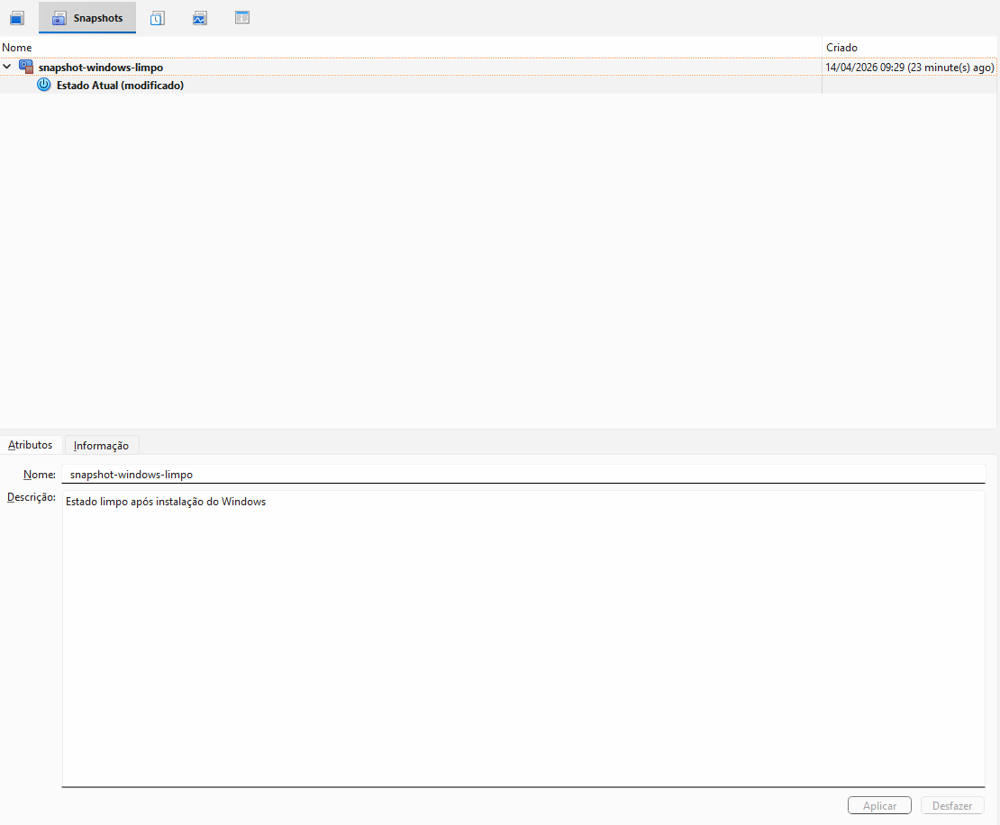
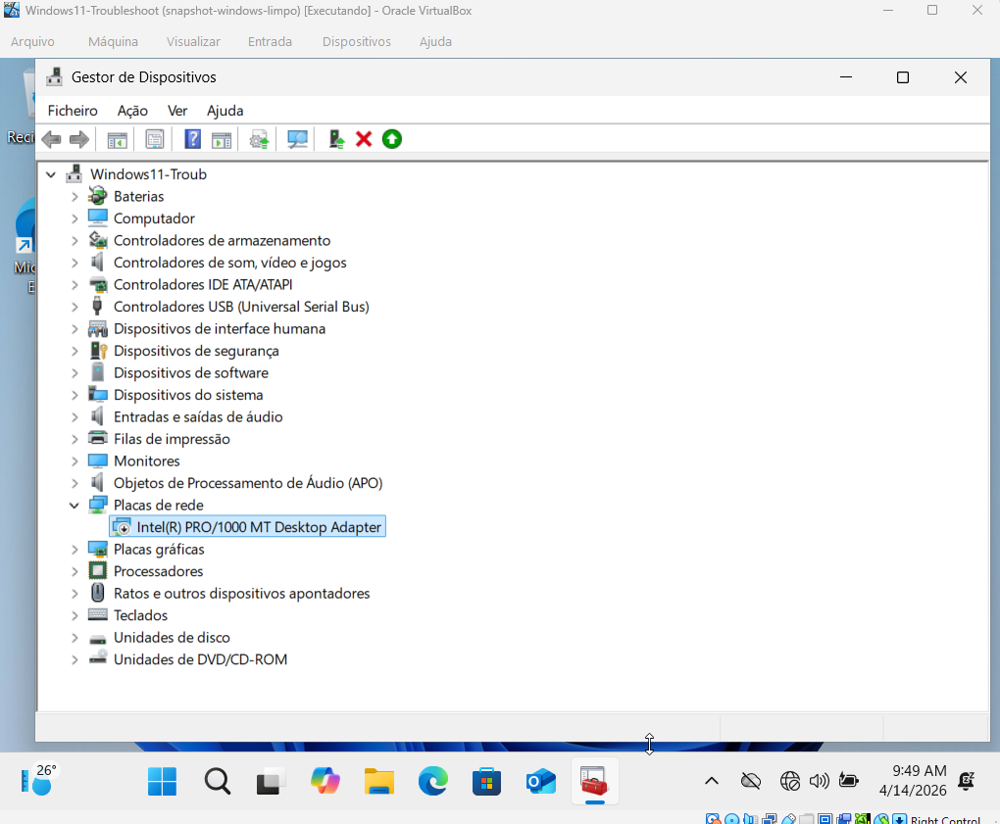
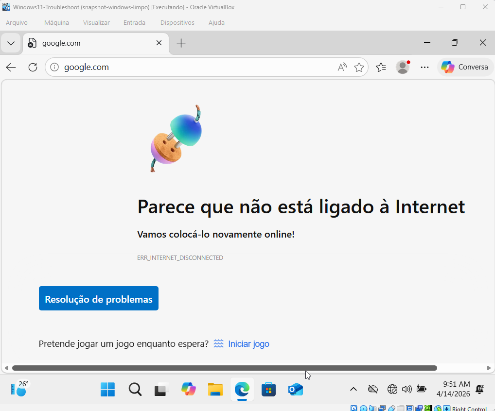
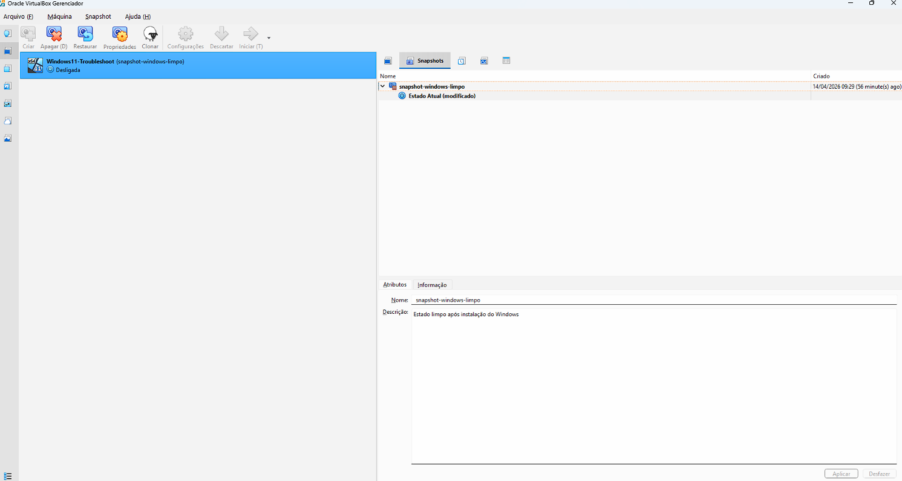
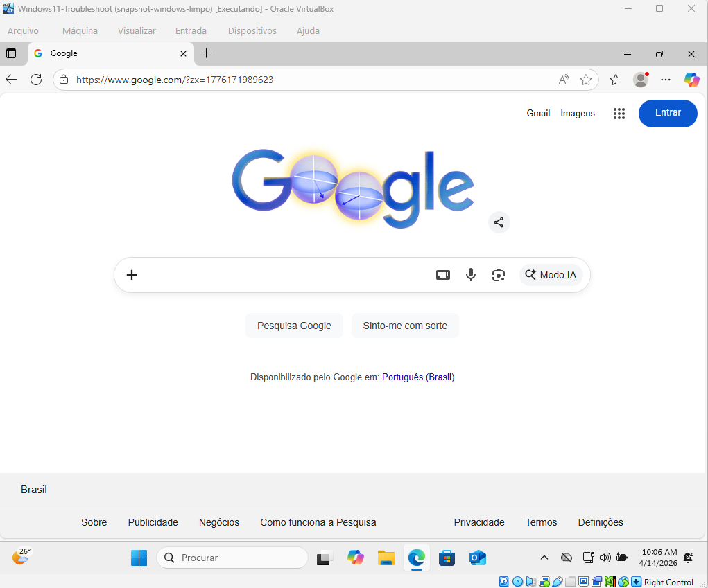

# 🔄 Rollback com Snapshot no VirtualBox (Windows 11)

## 📌 Descrição

Neste laboratório simulei um problema real de suporte técnico: perda de conexão com a internet após falha no adaptador de rede.

Em vez de corrigir manualmente, utilizei um snapshot previamente criado para realizar rollback do sistema, restaurando rapidamente o ambiente ao estado funcional.

---

## 🎯 Objetivo

Demonstrar na prática como utilizar snapshots para recuperação rápida de sistemas, técnica muito utilizada em ambientes de suporte e troubleshooting.

---

## 🧠 O que aprendi

- Como criar snapshots para preservar estados do sistema  
- Como simular falhas reais de rede  
- Como aplicar rollback para restaurar ambientes rapidamente  
- A importância de ambientes controlados para testes  

---

## ⚙️ Ambiente

- Windows 11 (máquina virtual)
- VirtualBox
- Adaptador de rede: Intel PRO/1000

---

## 💾 Etapa 1 — Criação do Snapshot

Criação de um snapshot representando o estado limpo do sistema após instalação e configuração inicial.

---

## ❌ Etapa 2 — Simulação do Problema

Desativação do adaptador de rede no Gerenciador de Dispositivos.

---

## 🌐 Etapa 3 — Impacto

Sistema sem acesso à internet após a falha.

---

## 🔄 Etapa 4 — Rollback

Restauração do sistema utilizando snapshot previamente criado.

---

## ✅ Etapa 5 — Validação

Após o rollback, o sistema voltou ao estado funcional, com acesso à internet restaurado.

---

## 🧪 Conclusão

O uso de snapshots permite restaurar rapidamente sistemas após falhas, evitando retrabalho e reduzindo o tempo de resolução.

Essa prática é amplamente utilizada em ambientes de suporte técnico, laboratórios e testes.

---

## 🚀 Próximos laboratórios

- Problema de DNS  
- Wi-Fi conectado sem internet  
- Falhas de comunicação na rede  
- Monitoramento com Zabbix  
