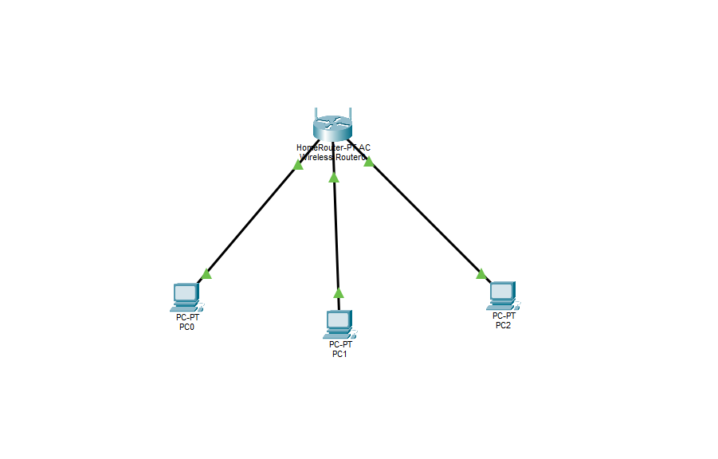
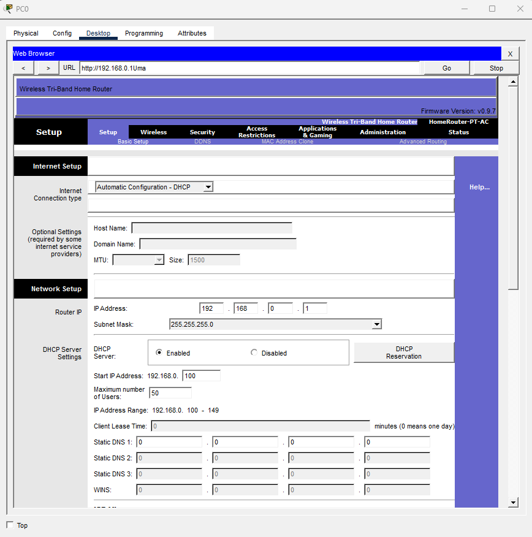
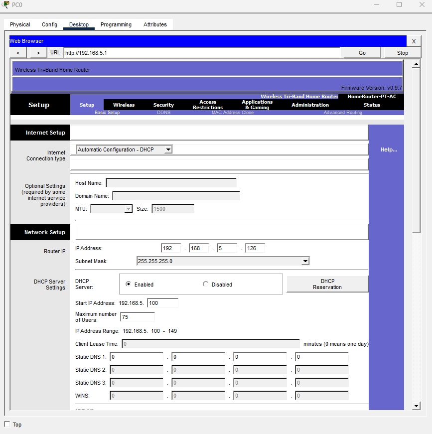
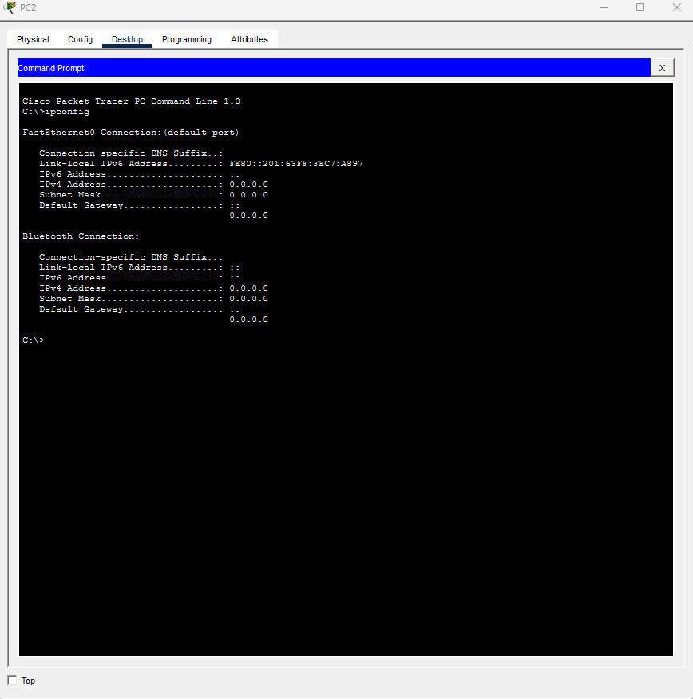
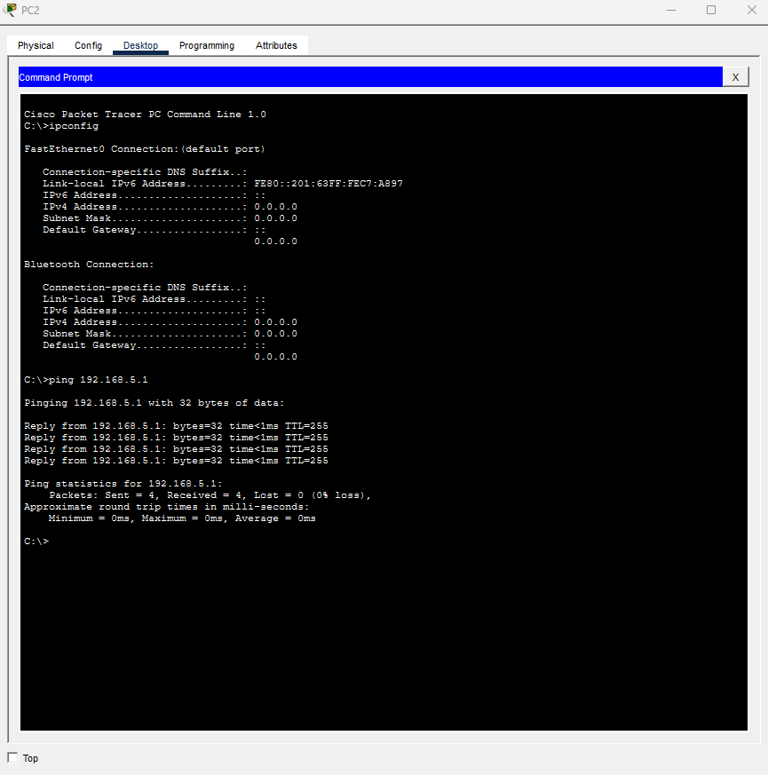
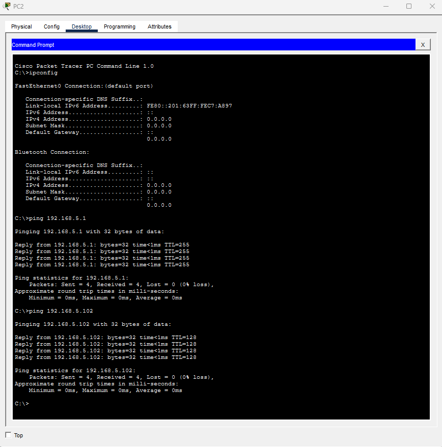

# Laboratório — Configuração de DHCP em Roteador Wireless

Este laboratório foi realizado utilizando o Cisco Packet Tracer com o objetivo de simular a configuração de uma rede local com um roteador wireless atuando como servidor DHCP.

---

## Topologia da rede

Três computadores conectados a um roteador wireless utilizando cabos Ethernet.



---

## Configuração inicial do roteador

Acesso ao painel de administração do roteador através do navegador utilizando o endereço do gateway padrão.



---

## Alteração da rede do roteador

O endereço IP do roteador foi alterado para:

```
192.168.5.1
```



---

## PC sem endereço IP

Antes da configuração DHCP, o computador não possuía endereço IPv4.



---

## Teste de conectividade com o gateway

Verificação da comunicação entre o computador e o roteador utilizando o comando:

```
ping 192.168.5.1
```



---

## Teste de comunicação entre os computadores

Verificação da comunicação entre os dispositivos da rede local.

```
ping 192.168.5.102
```


